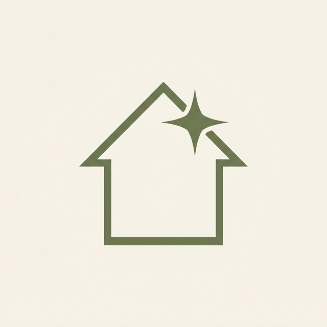
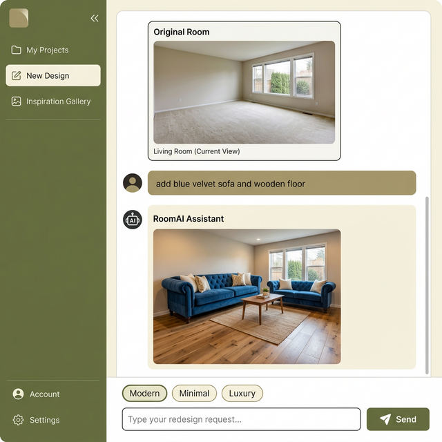
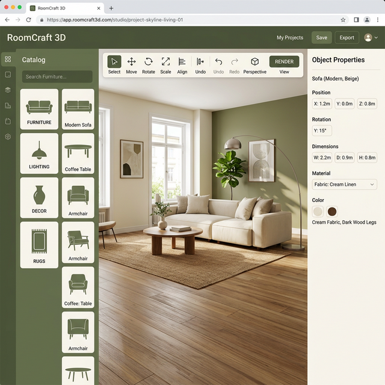
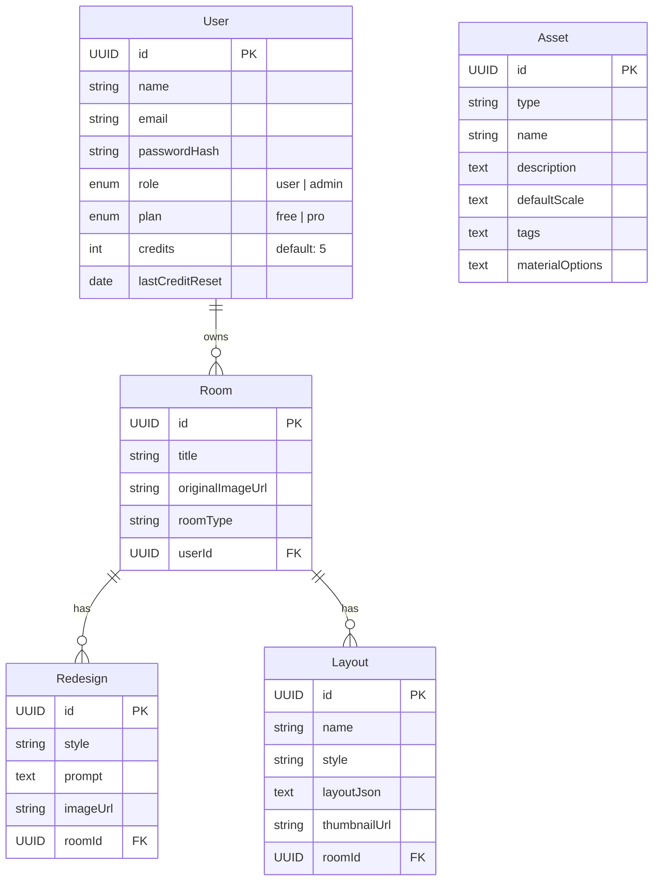

<!-- ═══════════════════════════════════════════════════════════ -->
<!-- ✦  D R E A M S P A C E   A I  —  README                    -->
<!-- ═══════════════════════════════════════════════════════════ -->

<div align="center">

  <!-- Logo -->
  

  <!-- Animated Typing Title -->
  <a href="#">
    
  </a>

  <br/>

  <a href="#">
    
  </a>

  <br/><br/>

  <!-- Badges -->
  <a href="#-tech-stack"></a>
  <a href="#-tech-stack"></a>
  <a href="#-tech-stack"></a>
  <a href="#-ai-engine"></a>
  <a href="#-tech-stack"></a>

  <br/><br/>

  <!-- Quick Links -->
  <a href="#-quick-start">🚀 Quick Start</a> •
  <a href="#-features">✨ Features</a> •
  <a href="#-screenshots">📸 Screenshots</a> •
  <a href="#-tech-stack">🛠️ Tech Stack</a> •
  <a href="#-team">👥 Team</a> •
  <a href="#-api-reference">📡 API</a>

  <br/><br/>

  </div>

<br/>

---

<br/>

## 🌟 About The Project

> **DreamSpace AI** is a full-stack interior design platform that combines **AI-powered photorealistic room redesigns** with an **interactive 3D furniture studio**. Upload a photo of any room, describe what you want in natural language, and watch AI transform your space — then fine-tune every detail in our 3D environment.

<br/>

<div align="center">
  <table>
    <tr>
      <td align="center" width="25%">
        <br/>
        <b>React 18</b><br/>
        <sub>Modern UI Framework</sub>
      </td>
      <td align="center" width="25%">
        <br/>
        <b>Three.js</b><br/>
        <sub>3D Rendering Engine</sub>
      </td>
      <td align="center" width="25%">
        <br/>
        <b>Node.js</b><br/>
        <sub>Backend Runtime</sub>
      </td>
      <td align="center" width="25%">
        <br/>
        <b>Hugging Face</b><br/>
        <sub>AI Image Generation</sub>
      </td>
    </tr>
  </table>
</div>

<br/>

---

<br/>

## ✨ Features

<table>
  <tr>
    <td>
      <h3>🤖 AI Room Redesign</h3>
      <p>True <b>image-to-image</b> processing — AI transforms your <i>actual room photo</i> while preserving walls, windows, and layout. Not just a random generation.</p>
      <ul>
        <li>Stable Diffusion XL powered</li>
        <li>40 inference steps for high quality</li>
        <li>Room structure preservation (0.65 strength)</li>
        <li>Cascading fallback: img2img → text2img → Sharp</li>
      </ul>
    </td>
    <td>
      <h3>💬 Chat-Style Prompts</h3>
      <p>Describe what you want in <b>natural language</b> — like chatting with an interior designer. The AI follows your instructions.</p>
      <ul>
        <li>"Add a blue velvet sofa and wooden floor"</li>
        <li>"Make the room brighter with warm lights"</li>
        <li>"Add indoor plants and greenery"</li>
        <li>10 built-in prompt suggestions</li>
      </ul>
    </td>
  </tr>
  <tr>
    <td>
      <h3>🎮 3D Furniture Studio</h3>
      <p>Interactive Three.js environment with <b>categorized product catalog</b>, real-time rendering, and precision tools.</p>
      <ul>
        <li>5 categories, 10 subcategories, 17+ items</li>
        <li>2D/3D view toggle</li>
        <li>Room dimension controls</li>
        <li>Move, rotate, scale, duplicate</li>
      </ul>
    </td>
    <td>
      <h3>🎨 6 Design Styles</h3>
      <p>Curated aesthetic presets, each with <b>optimized AI prompts</b> for the best results.</p>
      <ul>
        <li>🏢 Modern Minimal</li>
        <li>✨ Luxury Classic</li>
        <li>🌿 Boho Chic</li>
        <li>🕯️ Scandinavian · ⬜ Minimal · 🪔 Indian</li>
      </ul>
    </td>
  </tr>
  <tr>
    <td>
      <h3>🔐 Auth & Credits</h3>
      <p>JWT-based authentication with a <b>credit system</b> for fair AI usage.</p>
      <ul>
        <li>Register / Login with JWT tokens</li>
        <li>5 free AI credits per day</li>
        <li>Role-based access (user / admin)</li>
        <li>Admin dashboard with stats</li>
      </ul>
    </td>
    <td>
      <h3>📱 Responsive Design</h3>
      <p>Looks beautiful on <b>every screen size</b> — desktop, tablet, and mobile.</p>
      <ul>
        <li>Mobile hamburger menu</li>
        <li>Adaptive 3D studio layout</li>
        <li>Touch-friendly controls</li>
        <li>Luxury warm aesthetic (cream + olive)</li>
      </ul>
    </td>
  </tr>
</table>

<br/>

---

<br/>

## 📸 Screenshots

<div align="center">

### 💬 AI Chat Interface
*Upload your room → Type what you want → AI redesigns it*



<br/><br/>

### 🎮 3D Furniture Studio
*Browse categorized products → Place furniture → Customize materials*



</div>

<br/>

---

<br/>

## 🛠️ Tech Stack

<div align="center">

### Frontend

| Technology | Purpose | Version |
|:---:|:---|:---:|
|  **React** | Component-based UI framework | 18.3 |
|  **Vite** | Fast build tool & HMR dev server | 6.x |
|  **React Three Fiber** | 3D rendering (Three.js via React) | latest |
| 🧸 **Drei** | Three.js helpers & abstractions | latest |
| 🐻 **Zustand** | Lightweight state management | 5.x |
| 🔀 **React Router** | Client-side routing | 7.x |
| 📡 **TanStack Query** | Server state & data fetching | 5.x |
| 🎨 **Lucide React** | Icon library | latest |

### Backend

| Technology | Purpose | Version |
|:---:|:---|:---:|
|  **Node.js** | JavaScript runtime | 20.11+ |
|  **Express** | Web framework & REST API | 4.x |
| 🗄️ **Sequelize** | ORM for database operations | 6.x |
|  **TiDB Cloud** | Production MySQL-compatible database | Cloud |
| 🔑 **JWT** | Authentication tokens | latest |
| 🖼️ **Sharp** | Image processing (fallback) | latest |
| 📁 **Multer** | File upload handling | latest |

### AI Engine

| Technology | Purpose |
|:---:|:---|
| 🤗 **Hugging Face API** | AI model hosting & inference |
| 🎨 **Stable Diffusion XL** | Photorealistic image generation |
| 🖼️ **img2img Pipeline** | Room structure-preserving redesign |
| ⚡ **Sharp Processing** | Enhanced fallback when AI unavailable |

</div>

<br/>

---

<br/>

## 🚀 Quick Start

### Prerequisites

```
✓ Node.js 20.11+ installed
✓ npm package manager
✓ TiDB Cloud database credentials
✓ (Optional) Hugging Face API key for AI features
```

### Installation

```bash
# 1️⃣ Clone the repository
git clone https://github.com/your-username/RoomDecor.git
cd RoomDecor

# 2️⃣ Install all dependencies
npm run install:all
```

### Configuration

Create `server/.env` from `server/.env.example` and set your TiDB Cloud, JWT, provider, and email values:

```env
PORT=5000
JWT_SECRET=your_super_secret_key_here
JWT_EXPIRES_IN=7d

TIDB_HOST=gateway01.region.provider.tidbcloud.com
TIDB_PORT=4000
TIDB_USER=your_cluster_prefix.root
TIDB_PASSWORD=your_tidb_password
TIDB_DB_NAME=roomDecor
TIDB_ENABLE_SSL=true
DB_SSL=true

HUGGINGFACE_API_KEY=hf_your_api_key_here
HF_MODEL=stabilityai/stable-diffusion-xl-base-1.0
```

> 💡 **No API key?** No problem! The app uses enhanced Sharp image processing as fallback — it still looks great!

### Run the App

```bash
# Optional: create/test the TiDB database and tables
npm run db:init
npm run db:test

# Run the full stack
npm run dev
```

For Render production deployment, use `render.yaml` and follow `DEPLOYMENT.md`.

<br/>

---

<br/>

## 📁 Project Structure

```
RoomDecor/
│
├── 📄 README.md                        ← You are here
├── 🎨 assets/                          ← Logo, banner, screenshots
│
├── 🖥️ client/                          ← React Frontend
│   ├── index.html
│   ├── vite.config.js
│   └── src/
│       ├── main.jsx                    ← App entry point
│       ├── App.jsx                     ← Routes & layout
│       ├── index.css                   ← 2700+ lines of styling
│       │
│       ├── 📡 api/
│       │   └── client.js               ← API client (auth, rooms, AI, layouts)
│       │
│       ├── 🧩 components/
│       │   ├── Navbar.jsx              ← Navigation + mobile menu
│       │   └── ToastContainer.jsx      ← Toast notifications
│       │
│       ├── 🏪 store/
│       │   ├── authStore.js            ← Auth state (Zustand)
│       │   ├── studioStore.js          ← 3D studio state
│       │   └── toastStore.js           ← Toast state
│       │
│       └── 📄 pages/
│           ├── HomePage.jsx            ← Landing (hero, features, pricing, FAQ)
│           ├── RoomPage.jsx            ← 💬 AI Chat Interface
│           ├── StudioPage.jsx          ← 🎮 3D Furniture Studio
│           ├── DashboardPage.jsx       ← User dashboard
│           ├── UploadPage.jsx          ← Room photo upload
│           ├── AboutPage.jsx           ← About page
│           ├── ContactPage.jsx         ← Contact form
│           ├── LoginPage.jsx           ← Login
│           ├── RegisterPage.jsx        ← Register
│           └── AdminPage.jsx           ← Admin panel
│
└── ⚙️ server/                          ← Node.js Backend
    ├── .env                            ← Environment variables
    └── src/
        ├── index.js                    ← Express server entry
        │
        ├── ⚙️ config/
        │   ├── database.js             ← Sequelize + SQLite setup
        │   └── seed.js                 ← Database seeding
        │
        ├── 🔒 middleware/
        │   ├── auth.js                 ← JWT auth + credit check
        │   └── upload.js               ← Multer file upload
        │
        ├── 📊 models/
        │   └── index.js                ← User, Room, Redesign, Layout, Asset
        │
        ├── 🛣️ routes/
        │   ├── auth.js                 ← POST /register, /login, GET /me
        │   ├── rooms.js                ← CRUD rooms + image upload
        │   ├── redesigns.js            ← POST redesign (AI generation)
        │   ├── layouts.js              ← Save/load 3D layouts
        │   ├── assets.js               ← Furniture catalog API
        │   └── admin.js                ← Admin stats & user management
        │
        └── 🤖 services/
            ├── aiService.js            ← HF img2img + Sharp fallback
            └── autoDecorService.js     ← Auto-decorate AI
```

<br/>

---

<br/>

## 🗄️ Database Schema



<br/>

---

<br/>

## 📡 API Reference

<details>
<summary><b>🔐 Authentication</b></summary>

| Method | Endpoint | Body | Description |
|:---:|:---|:---|:---|
| `POST` | `/api/auth/register` | `{ name, email, password }` | Create account |
| `POST` | `/api/auth/login` | `{ email, password }` | Login → JWT token |
| `GET` | `/api/auth/me` | — | Get current user |

</details>

<details>
<summary><b>🏠 Rooms</b></summary>

| Method | Endpoint | Body | Description |
|:---:|:---|:---|:---|
| `POST` | `/api/rooms` | `FormData (image, title, roomType)` | Upload room photo |
| `GET` | `/api/rooms` | — | List all user rooms |
| `GET` | `/api/rooms/:id` | — | Get room details |
| `DELETE` | `/api/rooms/:id` | — | Delete room |

</details>

<details>
<summary><b>🤖 AI Redesign</b></summary>

| Method | Endpoint | Body | Description |
|:---:|:---|:---|:---|
| `POST` | `/api/rooms/:id/redesign` | `{ style, customPrompt? }` | Generate AI redesign |
| `GET` | `/api/rooms/:id/redesigns` | — | List all redesigns |

**Supported styles:** `modern`, `minimal`, `luxury`, `boho`, `scandinavian`, `indian_contemporary`

**Example custom prompt:**
```json
{
  "style": "modern",
  "customPrompt": "add a blue velvet sofa, wooden floor, and pendant lights"
}
```

</details>

<details>
<summary><b>🎮 Layouts</b></summary>

| Method | Endpoint | Body | Description |
|:---:|:---|:---|:---|
| `POST` | `/api/layouts/:roomId/layouts` | `{ name, style, layoutJson }` | Save 3D layout |
| `GET` | `/api/layouts/:roomId/layouts` | — | List room layouts |
| `GET` | `/api/layouts/detail/:id` | — | Get layout detail |
| `POST` | `/api/layouts/:roomId/auto-decorate` | `{ style }` | Auto-decorate room |

</details>

<details>
<summary><b>📦 Assets & Admin</b></summary>

| Method | Endpoint | Description |
|:---:|:---|:---|
| `GET` | `/api/assets` | List all furniture assets |
| `GET` | `/api/assets?type=chair` | Filter by type |
| `GET` | `/api/admin/users` | List all users (admin) |
| `GET` | `/api/admin/stats` | Platform statistics (admin) |

</details>

<br/>

---

<br/>

## 🎨 Design System

<div align="center">

### Color Palette

| Color | Hex | Usage |
|:---:|:---:|:---|
| 🟢 Olive | `#6B7F5E` | Primary brand color, CTAs, active states |
| 🟤 Dark | `#1A1714` | Headings, primary text |
| 🔘 Charcoal | `#3D3831` | Body text |
| 🟡 Gold | `#C8A96E` | Accents, highlights |
| ⬜ Cream | `#FAF6F0` | Backgrounds |
| 🟠 Beige | `#E8DFD1` | Borders, dividers |

### Typography

| Font | Usage |
|:---|:---|
| **Cormorant Garamond** (Serif) | Headings, display text |
| **Inter** (Sans-serif) | Body text, UI elements |

</div>

<br/>

---

<br/>

## 🤖 AI Engine

<div align="center">

```
┌─────────────────────────────────────────────────────┐
│                  AI REDESIGN PIPELINE                 │
├─────────────────────────────────────────────────────┤
│                                                       │
│   📷 Upload Room Photo                                │
│         ↓                                             │
│   📝 User Prompt + Style Selection                    │
│         ↓                                             │
│   🔀 Prompt Builder                                   │
│      (merges style prompt + custom prompt + room type)│
│         ↓                                             │
│   ┌─── Try 1: img2img (SDXL Refiner) ───┐           │
│   │  Sends room photo as base64          │           │
│   │  Strength: 0.65 (preserves layout)   │           │
│   │  Steps: 40, Guidance: 8.5            │           │
│   └──────────┬───────────────────────────┘           │
│              ↓ (if fails)                             │
│   ┌─── Try 2: text-to-image (SDXL) ─────┐           │
│   │  Generates from prompt only          │           │
│   │  1024×768, Steps: 35                 │           │
│   └──────────┬───────────────────────────┘           │
│              ↓ (if fails)                             │
│   ┌─── Try 3: Sharp Processing ──────────┐           │
│   │  Color grading + filters             │           │
│   │  Style-specific transform pipeline   │           │
│   │  Always works (no API needed)        │           │
│   └──────────┬───────────────────────────┘           │
│              ↓                                        │
│   ✅ Result: Redesigned Room Image                    │
│                                                       │
└─────────────────────────────────────────────────────┘
```

</div>

<br/>

---

<br/>

## 👥 Team

<div align="center">

### The Code Architects ✦

<table>
  <tr>
    <td align="center">
      <b>🖥️ Member 1</b><br/>
      <sub><b>Frontend Developer</b></sub><br/>
      <sub>React, CSS, Pages, Responsive UI</sub>
    </td>
    <td align="center">
      <b>⚙️ Member 2</b><br/>
      <sub><b>Backend Developer</b></sub><br/>
      <sub>Express, Sequelize, Auth, APIs</sub>
    </td>
    <td align="center">
      <b>🎮 Member 3</b><br/>
      <sub><b>3D Studio Developer</b></sub><br/>
      <sub>Three.js, Product Catalog, Layouts</sub>
    </td>
    <td align="center">
      <b>🤖 Member 4</b><br/>
      <sub><b>AI Engineer</b></sub><br/>
      <sub>Hugging Face, img2img, Chat UI</sub>
    </td>
  </tr>
</table>

</div>

<br/>

---

<br/>

## 📋 How to Contribute

```bash
# 1. Fork the repository
# 2. Create your feature branch
git checkout -b feature/amazing-feature

# 3. Commit your changes
git commit -m "feat: add amazing feature"

# 4. Push to the branch
git push origin feature/amazing-feature

# 5. Open a Pull Request
```

<br/>

---

<br/>

## 📄 License

This project is built for **educational purposes** by **The Code Architects**.

<br/>

---

<div align="center">

  

  <br/>

  **DreamSpace AI** — Built with ❤️ by The Code Architects

  <br/>

  <a href="#-about-the-project">Back to Top ↑</a>

  <br/><br/>

  

</div>
